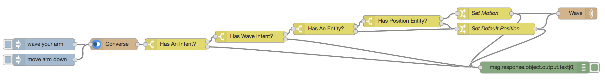

# Day 19 - Wave Intent 

Today we'll train TJBot how to understand natural language and move the arm using the converse node and the Watson Conversation service.

[](https://www.youtube.com/watch?v=IVWxhUoutWk&list=PLddOPkVMz1dtN3I_4JKava4GBLLXuUevV&index=22 "Train TJBot to Wave Intent in Node-RED") 

## Flow

The flow consists of an inject node to run the flow, a converse node to process the natural language input into intents, entities, and a dialog response using the Watson Conversation service, four switch nodes to check if the wave intent and position entity exist, two change nodes to set the desired motion for the wave node, a wave node to move the arm to the position mentioned, and a debug node to output the response in the debug window.

 

## Flow JSON

```
[{"id":"d7d4f329.755f8","type":"inject","z":"4f8a700b.20a01","name":"","topic":"","payload":"wave your arm","payloadType":"str","repeat":"","crontab":"","once":false,"x":200,"y":120,"wires":[["275eead8.4fd8e6"]]},{"id":"275eead8.4fd8e6","type":"tjbot-converse","z":"4f8a700b.20a01","botId":"d952def0.3bf0b8","name":"","x":380,"y":120,"wires":[["34f1bc0f.ebe72c"]]},{"id":"34f1bc0f.ebe72c","type":"switch","z":"4f8a700b.20a01","name":"Has An Intent?","property":"response.object.intents.length","propertyType":"msg","rules":[{"t":"gt","v":"0","vt":"num"},{"t":"else"}],"checkall":"false","outputs":2,"x":540,"y":120,"wires":[["c376591d.5635a"],["90e61d92.6bd92"]]},{"id":"c376591d.5635a","type":"switch","z":"4f8a700b.20a01","name":"Has Wave Intent?","property":"response.object.intents[0].intent","propertyType":"msg","rules":[{"t":"eq","v":"wave","vt":"str"},{"t":"else"}],"checkall":"false","outputs":2,"x":730,"y":100,"wires":[["e8a58d20.812918"],["90e61d92.6bd92"]]},{"id":"e8a58d20.812918","type":"switch","z":"4f8a700b.20a01","name":"Has An Entity?","property":"response.object.entities.length","propertyType":"msg","rules":[{"t":"gt","v":"0","vt":"num"},{"t":"else"}],"checkall":"false","outputs":2,"x":920,"y":80,"wires":[["bc06a289.848ee8"],["62f42a79.bcfcb4"]]},{"id":"bc06a289.848ee8","type":"switch","z":"4f8a700b.20a01","name":"Has Position Entity?","property":"response.object.entities[0].entity","propertyType":"msg","rules":[{"t":"eq","v":"position","vt":"str"},{"t":"else"}],"checkall":"false","outputs":2,"x":1120,"y":60,"wires":[["7149511a.ebd628"],["62f42a79.bcfcb4"]]},{"id":"7149511a.ebd628","type":"change","z":"4f8a700b.20a01","name":"Set Motion","rules":[{"t":"set","p":"motion","pt":"msg","to":"response.object.entities[0].value","tot":"msg"}],"action":"","property":"","from":"","to":"","reg":false,"x":1330,"y":40,"wires":[["a17f375a.d1a3e8","90e61d92.6bd92"]]},{"id":"62f42a79.bcfcb4","type":"change","z":"4f8a700b.20a01","name":"Set Default Position","rules":[{"t":"set","p":"motion","pt":"msg","to":"wave","tot":"str"}],"action":"","property":"","from":"","to":"","reg":false,"x":1360,"y":80,"wires":[["a17f375a.d1a3e8","90e61d92.6bd92"]]},{"id":"a17f375a.d1a3e8","type":"tjbot-wave","z":"4f8a700b.20a01","botId":"d952def0.3bf0b8","motion":"msg.motion","name":"","x":1570,"y":40,"wires":[]},{"id":"90e61d92.6bd92","type":"debug","z":"4f8a700b.20a01","name":"","active":true,"console":"false","complete":"response.object.output.text[0]","x":1460,"y":180,"wires":[]},{"id":"5414eb91.e094bc","type":"inject","z":"4f8a700b.20a01","name":"","topic":"","payload":"move arm down","payloadType":"str","repeat":"","crontab":"","once":false,"x":200,"y":160,"wires":[["275eead8.4fd8e6"]]},{"id":"d952def0.3bf0b8","type":"tjbot-config","z":"","botGender":"male","name":"TJBot","hasServo":true,"hasLED":false,"hasSpeaker":false,"hasMicrophone":false,"hasCamera":false,"speakerDeviceId":"plughw:0,0"}]

```

## Conversation Workspace JSON

```
{"name":"TJBot","created":"2017-08-19T21:51:26.835Z","intents":[{"intent":"wave","created":"2017-08-19T21:51:41.768Z","updated":"2017-08-19T21:52:11.261Z","examples":[{"text":"wave arm","created":"2017-08-19T21:51:45.084Z","updated":"2017-08-19T21:51:45.084Z"},{"text":"wave your arm","created":"2017-08-19T21:51:49.854Z","updated":"2017-08-19T21:51:49.854Z"},{"text":"lift arm","created":"2017-08-19T21:51:54.179Z","updated":"2017-08-19T21:51:54.179Z"},{"text":"lower arm","created":"2017-08-19T21:51:57.511Z","updated":"2017-08-19T21:51:57.511Z"},{"text":"raise arm","created":"2017-08-19T21:52:01.070Z","updated":"2017-08-19T21:52:01.070Z"},{"text":"move arm","created":"2017-08-19T21:52:06.185Z","updated":"2017-08-19T21:52:06.185Z"},{"text":"move your arm","created":"2017-08-19T21:52:11.261Z","updated":"2017-08-19T21:52:11.261Z"}],"description":null}],"updated":"2017-08-19T21:56:25.171Z","entities":[{"entity":"position","values":[{"value":"raisearm","created":"2017-08-19T21:52:44.365Z","updated":"2017-08-19T21:53:07.665Z","metadata":null,"synonyms":["lift","raise","up","raise arm"]},{"value":"lowerarm","created":"2017-08-19T21:53:16.523Z","updated":"2017-08-19T21:53:36.573Z","metadata":null,"synonyms":["drop","down","lower","lower arm"]},{"value":"armback","created":"2017-08-19T21:53:41.891Z","updated":"2017-08-19T21:54:01.974Z","metadata":null,"synonyms":["arm back","backward","backwards","back"]}],"created":"2017-08-19T21:52:39.729Z","updated":"2017-08-19T21:54:01.974Z","metadata":null,"description":null}],"language":"en","metadata":{"api_version":{"major_version":"v1","minor_version":"2017-05-26"}},"description":"","dialog_nodes":[{"title":null,"output":{},"parent":null,"context":null,"created":"2017-08-19T21:54:27.094Z","updated":"2017-08-19T21:54:40.943Z","metadata":null,"next_step":null,"conditions":"#wave","description":null,"dialog_node":"node_1_1503179666747","previous_sibling":"Welcome"},{"title":null,"output":{"text":{"values":["Hello. How can I help you?"],"selection_policy":"sequential"}},"parent":null,"context":null,"created":"2017-08-19T21:54:18.438Z","updated":"2017-08-19T21:54:18.438Z","metadata":null,"next_step":null,"conditions":"welcome","description":null,"dialog_node":"Welcome","previous_sibling":null},{"title":null,"output":{"text":{"values":["I didn't understand. You can try rephrasing.","Can you reword your statement? I'm not understanding.","I didn't get your meaning."],"selection_policy":"sequential"}},"parent":null,"context":null,"created":"2017-08-19T21:54:18.438Z","updated":"2017-08-19T21:54:18.438Z","metadata":null,"next_step":null,"conditions":"anything_else","description":null,"dialog_node":"Anything else","previous_sibling":"node_1_1503179666747"},{"type":"response_condition","title":null,"output":{"text":{"values":["I can lower my arm like this."],"selection_policy":"sequential"}},"parent":"node_1_1503179666747","context":null,"created":"2017-08-19T21:55:08.005Z","updated":"2017-08-19T21:55:35.203Z","metadata":null,"next_step":null,"conditions":" @position:lowerarm","description":null,"dialog_node":"node_3_1503179707794","previous_sibling":"node_2_1503179680357"},{"type":"response_condition","title":null,"output":{"text":{"values":["I can move my arm back like this."],"selection_policy":"sequential"}},"parent":"node_1_1503179666747","context":null,"created":"2017-08-19T21:55:36.275Z","updated":"2017-08-19T21:55:56.137Z","metadata":null,"next_step":null,"conditions":" @position:armback","description":null,"dialog_node":"node_4_1503179736038","previous_sibling":"node_3_1503179707794"},{"type":"response_condition","title":null,"output":{"text":{"values":["I can raise my arm like this."],"selection_policy":"sequential"}},"parent":"node_1_1503179666747","context":null,"created":"2017-08-19T21:54:40.578Z","updated":"2017-08-19T21:55:05.714Z","metadata":null,"next_step":null,"conditions":" @position:raisearm","description":null,"dialog_node":"node_2_1503179680357","previous_sibling":null},{"type":"response_condition","title":null,"output":{"text":{"values":["I can wave my arm like this."],"selection_policy":"sequential"}},"parent":"node_1_1503179666747","context":null,"created":"2017-08-19T21:55:58.326Z","updated":"2017-08-19T21:56:25.171Z","metadata":null,"next_step":null,"conditions":" true","description":null,"dialog_node":"node_5_1503179758023","previous_sibling":"node_4_1503179736038"}],"workspace_id":"39957c1b-3a0f-4316-8d58-e40bfc314281","counterexamples":[],"learning_opt_out":false}
```

## Tips

* Don't forget to create a Watson Conversation service and use the service credentials in the TJBot configuration
* Enable the servo in the TJBot configuration

## Extra Credit

* Add additional training phrases to expand the vocabulary TJBot can understand
	
## Resources

If this is your first time using [Node-RED](https://nodered.org/), check out the [docs](https://nodered.org/docs/) for the Getting Started guide.
