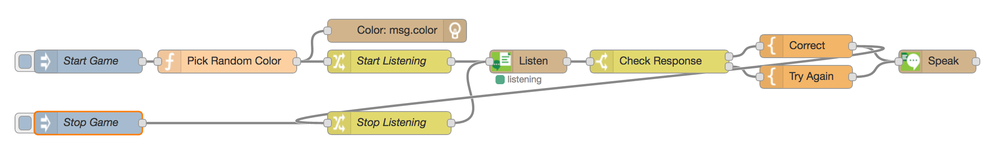

# Day 25 - Say The Color Game

Today we'll train TJBot to play a game where the player speaks the name of the color TJBot shines the light.

[](https://www.youtube.com/watch?v=cMJP9izsJis&list=PLddOPkVMz1dtN3I_4JKava4GBLLXuUevV&index=28 "Train TJBot to Play Say The Color Game in Node-RED") 

## Flow

The flow consists of a function node to randomly pick a color, a shine node to light the LED the random color, a listen node to listen to the user recall the name of the color using the Watson Speech to Text service, a switch node to check the answer, two template nodes to construct the response to the user when correct or incorrect, and a speak node to speak the response back to the user using the Watson Text to Speech service.

 

## Flow JSON

```
[{"id":"519fea80.03addc","type":"inject","z":"4f8a700b.20a01","name":"Start Game","topic":"","payload":"","payloadType":"date","repeat":"","crontab":"","once":false,"x":210,"y":180,"wires":[["448fc520.8a809c"]]},{"id":"e09ecb3.83181b8","type":"inject","z":"4f8a700b.20a01","name":"Stop Game","topic":"","payload":"","payloadType":"date","repeat":"","crontab":"","once":false,"x":210,"y":260,"wires":[["e50d55e8.e6819"]]},{"id":"448fc520.8a809c","type":"function","z":"4f8a700b.20a01","name":"Pick Random Color","func":"var colors = [\"red\", \"green\", \"blue\", \"yellow\", \"magenta\"];\n\nmsg.color = colors[Math.floor(Math.random()*colors.length)];\nreturn msg;\n","outputs":1,"noerr":0,"x":390,"y":180,"wires":[["1542cf8a.6ef4b","25076c32.d45edc"]]},{"id":"25076c32.d45edc","type":"change","z":"4f8a700b.20a01","name":"Start Listening","rules":[{"t":"set","p":"mode","pt":"msg","to":"start","tot":"str"},{"t":"set","p":"color","pt":"flow","to":"color","tot":"msg"}],"action":"","property":"","from":"","to":"","reg":false,"x":600,"y":180,"wires":[["1f268566.93e39b"]]},{"id":"1542cf8a.6ef4b","type":"tjbot-shine","z":"4f8a700b.20a01","botId":"10849cdb.c99ff3","mode":"shine","color":"msg.color","duration":"","name":"","x":610,"y":140,"wires":[]},{"id":"1f268566.93e39b","type":"tjbot-listen","z":"4f8a700b.20a01","botId":"10849cdb.c99ff3","name":"","x":780,"y":180,"wires":[["7ccb22c8.56260c"]]},{"id":"7ccb22c8.56260c","type":"switch","z":"4f8a700b.20a01","name":"Check Response","property":"payload","propertyType":"msg","rules":[{"t":"cont","v":"color","vt":"flow"},{"t":"else"}],"checkall":"false","outputs":2,"x":950,"y":180,"wires":[["44cb0bb5.9ad7dc"],["7b009ec5.5cdc58"]]},{"id":"44cb0bb5.9ad7dc","type":"template","z":"4f8a700b.20a01","name":"Correct","field":"payload","fieldType":"msg","format":"handlebars","syntax":"mustache","template":"That's right! The color is {{flow.color}}","output":"str","x":1140,"y":160,"wires":[["4fef892f.cdae98","e50d55e8.e6819"]]},{"id":"7b009ec5.5cdc58","type":"template","z":"4f8a700b.20a01","name":"Try Again","field":"payload","fieldType":"msg","format":"handlebars","syntax":"mustache","template":"Hmm. Try again.","output":"str","x":1140,"y":200,"wires":[["4fef892f.cdae98"]]},{"id":"4fef892f.cdae98","type":"tjbot-speak","z":"4f8a700b.20a01","botId":"10849cdb.c99ff3","mode":"speak","payload":"","name":"","x":1310,"y":180,"wires":[[]]},{"id":"e50d55e8.e6819","type":"change","z":"4f8a700b.20a01","name":"Stop Listening","rules":[{"t":"set","p":"mode","pt":"msg","to":"stop","tot":"str"}],"action":"","property":"","from":"","to":"","reg":false,"x":600,"y":260,"wires":[["1f268566.93e39b"]]},{"id":"10849cdb.c99ff3","type":"tjbot-config","z":"","botGender":"male","name":"TJBot","listen":"en-US","speak":"en-US","hasServo":false,"hasLED":true,"hasSpeaker":true,"hasMicrophone":true,"hasCamera":false,"speakerDeviceId":"plughw:2,0"}]
```

## Pick Random Color JavaScript Function
```
var colors = ["red", "green", "blue", "yellow", "magenta"];

msg.color = colors[Math.floor(Math.random()*colors.length)];
return msg;

```

## Tips

* Don't forget to enable the hardware for the microphone, speaker, and LED, and add Watson Text to Speech and Speech to Text service credentials.

## Extra Credit

* Keep track of how many correct and incorrect answers are given
* Make the game multi-player
* Use the pulse mode to show a color, turn off, and then ask what color was seen
* Show multiple colors and include more challenging memory questions, like, what was the third color shown?
	
## Resources

If this is your first time using [Node-RED](https://nodered.org/), check out the [docs](https://nodered.org/docs/) for the Getting Started guide.
