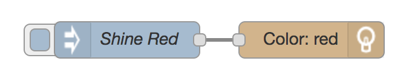

# Day 3 - Shine

Today we'll train TJBot to turn the LED red using the shine node.

[](https://www.youtube.com/watch?v=8htZriltJuc&index=6&list=PLddOPkVMz1dtN3I_4JKava4GBLLXuUevV "Train TJBot to Shine LED in Node-RED")

## Flow

The flow consists of two nodes, an inject node to trigger the flow, and a shine node to command the TJBot to turn the LED red.



## Flow JSON
```
[{"id":"a93fc14b.116548","type":"inject","z":"4f8a700b.20a01","name":"Shine Red","topic":"","payload":"","payloadType":"date","repeat":"","crontab":"","once":false,"x":200,"y":200,"wires":[["d8a6a830.6e5278"]]},{"id":"d8a6a830.6e5278","type":"tjbot-shine","z":"4f8a700b.20a01","botId":"e12946d4.bddad","mode":"shine","color":"red","duration":"","name":"","x":352.5,"y":200,"wires":[]},{"id":"e12946d4.bddad","type":"tjbot-config","z":"","botGender":"male","name":"TJBot","hasLED":true,"hasServo":false}]
```

## Tips

* The inject node is useful when you want to manually trigger a flow
* Make sure to enable the LED in the TJBot configuration

## Extra Credit

* Set the mode programmatically with `msg.mode` and the value `shine`
* Set the color programmatically with `msg.color` and the value `red`

## Resources

If this is your first time using [Node-RED](https://nodered.org/), check out the [docs](https://nodered.org/docs/) for the Getting Started guide.
