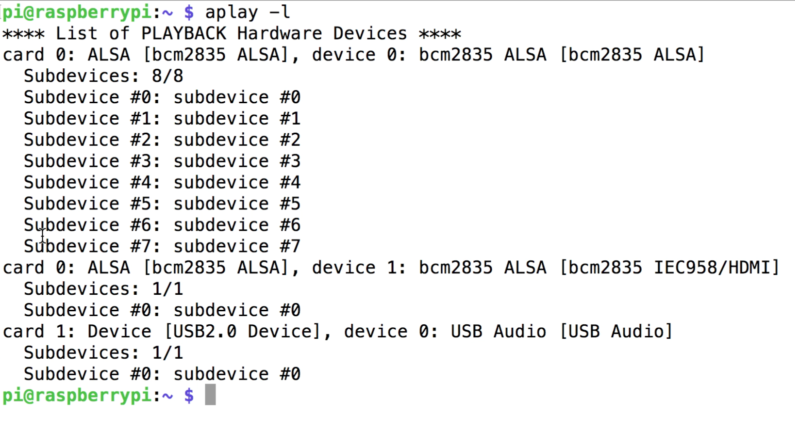

# Day 6 - Speak

Today we’ll train TJBot to speak using the speaker and the Watson Text to Speech service.

[](https://www.youtube.com/watch?v=cOd2FWa4eOw&index=9&list=PLddOPkVMz1dtN3I_4JKava4GBLLXuUevV "Train TJBot to Speak in Node-RED")

## Flow

The flow consists of an inject node with the phrase TJBot should speak and a speak node that synthesizes the phrase into an audio file played via the speaker using the Watson Text to Speech service.


## Flow JSON
```
[{"id":"9b562b4.77c4dd8","type":"inject","z":"4f8a700b.20a01","name":"","topic":"","payload":"Hello, I'm T. J. Bot","payloadType":"str","repeat":"","crontab":"","once":false,"x":350,"y":320,"wires":[["b4888e38.177dd8"]]},{"id":"b4888e38.177dd8","type":"tjbot-speak","z":"4f8a700b.20a01","botId":"a1cb227e.8dd59","mode":"speak","payload":"","name":"","x":530,"y":320,"wires":[[]]},{"id":"a1cb227e.8dd59","type":"tjbot-config","z":"","botGender":"male","name":"TJBot","hasLED":false,"hasServo":false,"speakerDeviceId":"plughw:1,0"}]
```

## Tips

* Audio not playing? Check the Speaker Device ID to make sure the right audio card and device are used.



## Extra Credit

* Choose another language for TJBot to speak and change the inject node to a greeting in that language

## Resources

If this is your first time using [Node-RED](https://nodered.org/), check out the [docs](https://nodered.org/docs/) for the Getting Started guide.
