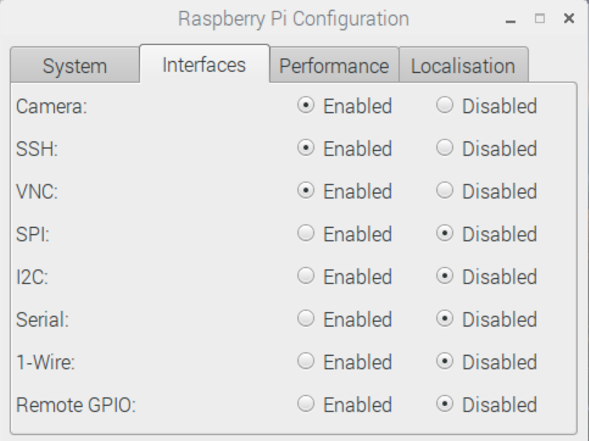

# Day 7 - See

Today we’ll train TJBot to see using the Raspberry Pi camera and the Watson Visual Recognition service.

[](https://www.youtube.com/watch?v=8XSo_CaY0rs&index=10&list=PLddOPkVMz1dtN3I_4JKava4GBLLXuUevV "Train TJBot to See in Node-RED") 

## Flow

The flow consists of an inject node to trigger the flow, a see node that takes a picture and classifies objects and colors using the Watson Visual Recognition service, and a debug node to output the results to the debug window.


## Flow JSON
```
[{"id":"11441808.df2808","type":"inject","z":"4f8a700b.20a01","name":"See","topic":"","payload":"","payloadType":"date","repeat":"","crontab":"","once":false,"x":330,"y":180,"wires":[["52a42b98.0b304c"]]},{"id":"52a42b98.0b304c","type":"tjbot-see","z":"4f8a700b.20a01","botId":"a1cb227e.8dd59","mode":"see","verticalFlip":false,"horizontalFlip":false,"width":960,"height":720,"name":"","x":460,"y":180,"wires":[["fb5f1b0.265c8e8"]]},{"id":"fb5f1b0.265c8e8","type":"debug","z":"4f8a700b.20a01","name":"","active":true,"console":"false","complete":"false","x":600,"y":180,"wires":[]},{"id":"a1cb227e.8dd59","type":"tjbot-config","z":"","botGender":"male","name":"TJBot","hasLED":false,"hasServo":false,"speakerDeviceId":"plughw:0,0"}]
```

## Tips

* Camera not enabled? Open the Raspberry Pi Configuration and tick the the radio button to enable the camera. Reboot the Raspberry Pi.



## Extra Credit

* Filter just the names of objects or just the names of colors
* Use the score value to omit to omit low scoring classes

## Resources

If this is your first time using [Node-RED](https://nodered.org/), check out the [docs](https://nodered.org/docs/) for the Getting Started guide.
