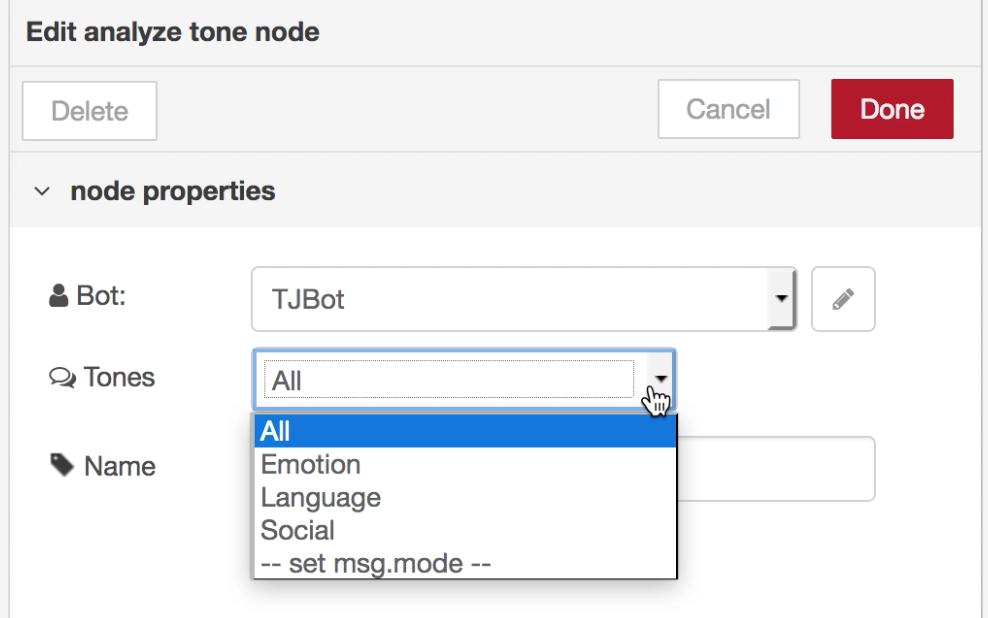

# Day 8 - Analyze Tone

Today we’ll train TJBot to analyze three types of tones using the Watson Tone Analyzer service.

[](https://www.youtube.com/watch?v=VuopoVT0uCo&index=11&list=PLddOPkVMz1dtN3I_4JKava4GBLLXuUevV "Train TJBot to Analyze Tone in Node-RED")

## Flow

The flow consists of an inject node to inject the content to analyze, an analyze tone node to analyze the three types of tone (emotion, language style, and social tendencies), and a debug node to output the results to the debug window.


## Flow JSON
```
[{"id":"d175e502.a4d218","type":"inject","z":"4f8a700b.20a01","name":"","topic":"","payload":"I like the TJBot","payloadType":"str","repeat":"","crontab":"","once":false,"x":300,"y":80,"wires":[["25e530e6.9979e"]]},{"id":"25e530e6.9979e","type":"tjbot-analyze-tone","z":"4f8a700b.20a01","botId":"a1cb227e.8dd59","tones":"all","name":"","x":490,"y":80,"wires":[["5cfd191c.41ffe8"]]},{"id":"5cfd191c.41ffe8","type":"debug","z":"4f8a700b.20a01","name":"","active":true,"console":"false","complete":"response","x":670,"y":80,"wires":[]},{"id":"a1cb227e.8dd59","type":"tjbot-config","z":"","name":"TJBot","hasLED":false,"hasServo":false,"speakerDeviceId":"plughw:1,0"}]
```

## Tips

* Don't forget to create a Watson Tone Analyzer service and use the service credentials in the TJBot configuration
* Use the Tones dropdown menu in the analyze tone node to limit the categories returned.



## Extra Credit

* Set the tones returned with `msg.mode` and the value `all`, `emotion`, `language`, or `social`

## Resources

If this is your first time using [Node-RED](https://nodered.org/), check out the [docs](https://nodered.org/docs/) for the Getting Started guide.
