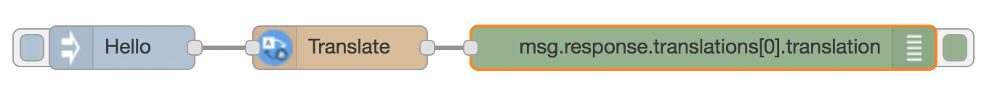
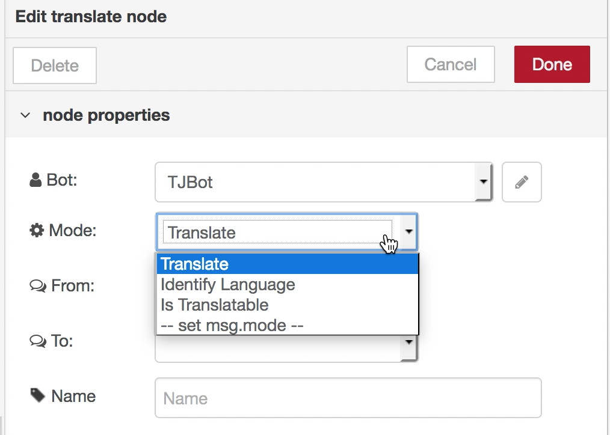

# Day 9 - Translate

Today we’ll train TJBot to translate content from English to Spanish using the Watson Language Translator service.

[](https://www.youtube.com/watch?v=oIM4dp-mctE&index=12&list=PLddOPkVMz1dtN3I_4JKava4GBLLXuUevV "Train TJBot to Translate in Node-RED") 

## Flow

The flow consists of an inject node to inject the greeting Hello, a translate node to translate the greeting from one language (English) to another (Spanish), and a debug node to output the translation in the debug window.


Change the debug output value to `msg.response.translations[0].translation` to dive into the response and output just the translation.

 

## Flow JSON

```
[{"id":"b2c27eb1.df92d","type":"inject","z":"4f8a700b.20a01","name":"","topic":"","payload":"Hello","payloadType":"str","repeat":"","crontab":"","once":false,"x":260,"y":140,"wires":[["17bdceb7.ed5049"]]},{"id":"17bdceb7.ed5049","type":"tjbot-translate","z":"4f8a700b.20a01","botId":"aab590a5.5053b8","srcLang":"en","targetLang":"es","mode":"translate","name":"","x":440,"y":140,"wires":[["517a0189.146898"]]},{"id":"517a0189.146898","type":"debug","z":"4f8a700b.20a01","name":"","active":true,"console":"false","complete":"response","x":620,"y":140,"wires":[]},{"id":"aab590a5.5053b8","type":"tjbot-config","z":"","botGender":"male","name":"TJBot","hasLED":false,"hasServo":false,"speakerDeviceId":"plughw:0,0"}]
```

Change the debug output value to `msg.response.translations[0].translation` to dive into the response and output just the translation.

```
[{"id":"b2c27eb1.df92d","type":"inject","z":"4f8a700b.20a01","name":"","topic":"","payload":"Hello","payloadType":"str","repeat":"","crontab":"","once":false,"x":290,"y":140,"wires":[["17bdceb7.ed5049"]]},{"id":"17bdceb7.ed5049","type":"tjbot-translate","z":"4f8a700b.20a01","botId":"aab590a5.5053b8","srcLang":"en","targetLang":"es","mode":"translate","name":"","x":440,"y":140,"wires":[["517a0189.146898"]]},{"id":"517a0189.146898","type":"debug","z":"4f8a700b.20a01","name":"","active":true,"console":"false","complete":"response.translations[0].translation","x":700,"y":140,"wires":[]},{"id":"aab590a5.5053b8","type":"tjbot-config","z":"","botGender":"male","name":"TJBot","hasLED":false,"hasServo":false,"speakerDeviceId":"plughw:0,0"}]

```


## Tips

* Don't forget to create a Watson Language Translator service and use the service credentials in the TJBot configuration
* Use the Mode dropdown menu to choose what action to take: translate content, identify the language, or check if there is a translation model between two languages.



## Extra Credit

* Set the mode of the translate node with `msg.mode` and the value `identifylanguage`, `istranslatable`, or `translate`
* Set the source language and target language with `msg.srcLang` and `msg.targetLang`, respectively, and values:

	* ar - Arabic
	* zh - Chinese
	* de - German
	* en - English
	* fr - French
	* it - Italian
	* ja - Japanese
	* ko - Korean
	* es - Spanish
	* pt - Portuguese
	
## Resources

If this is your first time using [Node-RED](https://nodered.org/), check out the [docs](https://nodered.org/docs/) for the Getting Started guide.
