# TJBot Node-RED Skills

This project contains resources for use in training the TJBot skills using Node-RED.

## Day 1 - Setting up your TJBot to use Node-RED

Resources: [GitHub](1-setup) | [Medium](https://medium.com/@jeancarlbisson/setting-up-your-tjbot-to-use-node-red-df94ff94a114) | YouTube [Part 1](https://www.youtube.com/watch?v=J23LdKeghBg&index=1&list=PLddOPkVMz1dtN3I_4JKava4GBLLXuUevV), [Part 2](https://www.youtube.com/watch?v=xLfpcJYa8eI&index=2&list=PLddOPkVMz1dtN3I_4JKava4GBLLXuUevV), [Part 3](https://www.youtube.com/watch?v=EKmSuDYbzhE&index=3&list=PLddOPkVMz1dtN3I_4JKava4GBLLXuUevV), [Part 4](https://www.youtube.com/watch?v=Je9VJv_sxt8&index=4&list=PLddOPkVMz1dtN3I_4JKava4GBLLXuUevV)

Today we'll learn how to flash the Raspbian Jessie with Desktop image to a microSD card; enable SSH, VNC, and the Camera interfaces, set an SSH password, and upgrade Node.js and Node-RED to the latest version; install a Node-RED package containing nodes that can be used with the TJBot; and create a profile for TJBot to use as we train it with different abilities to perform. 

## Day 2 - Wave

Resources: [GitHub](2-wave) | [Medium](https://medium.com/@jeancarlbisson/train-tjbot-to-wave-in-node-red-62826d269ba5) | [YouTube](https://www.youtube.com/watch?v=uE8pvLttipU&index=5&list=PLddOPkVMz1dtN3I_4JKava4GBLLXuUevV)

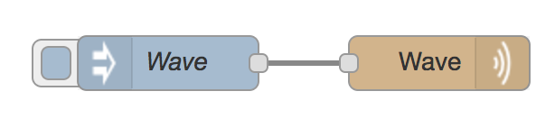

Today we'll train TJBot to wave using the wave node.

## Day 3 - Shine

Resources: [GitHub](3-shine) | [Medium](https://medium.com/@jeancarlbisson/train-tjbot-to-shine-led-in-node-red-918fcc6d844d) | [YouTube](https://www.youtube.com/watch?v=8htZriltJuc&index=6&list=PLddOPkVMz1dtN3I_4JKava4GBLLXuUevV)

Today we'll train TJBot to shine the LED the color red using the shine node.

## Day 4 - Pulse

Resources: [GitHub](4-pulse) | [Medium](https://medium.com/@jeancarlbisson/train-tjbot-to-pulse-the-led-in-node-red-ca044b2ef63) | [YouTube](https://www.youtube.com/watch?v=AkOWGQjlaXk&index=7&list=PLddOPkVMz1dtN3I_4JKava4GBLLXuUevV)

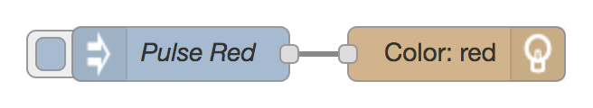

Today we'll train TJBot to pulse the LED the color red using the shine node.

## Day 5 - Listen

Resources: [GitHub](5-listen) | [Medium](https://medium.com/@jeancarlbisson/train-tjbot-to-listen-in-node-red-ab9500768c52) | [YouTube](https://www.youtube.com/watch?v=AFNUa7y5XeU&index=8&list=PLddOPkVMz1dtN3I_4JKava4GBLLXuUevV)

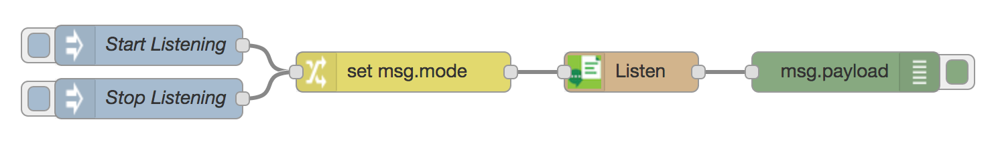

Today we’ll train TJBot to listen using the microphone and the Watson Speech to Text service.

## Day 6 - Speak

Resources: [GitHub](6-speak) | [Medium](https://medium.com/@jeancarlbisson/train-tjbot-to-speak-in-node-red-a424d801d5d3) | [YouTube](https://www.youtube.com/watch?v=cOd2FWa4eOw&index=9&list=PLddOPkVMz1dtN3I_4JKava4GBLLXuUevV)

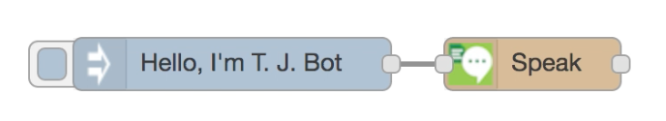

Today we’ll train TJBot to speak using the speaker and the Watson Text to Speech service.

## Day 7 - See

Resources: [GitHub](7-see) | [Medium](https://medium.com/@jeancarlbisson/train-tjbot-to-see-in-node-red-1821dd0513f6) | [YouTube](https://www.youtube.com/watch?v=8XSo_CaY0rs&index=10&list=PLddOPkVMz1dtN3I_4JKava4GBLLXuUevV)

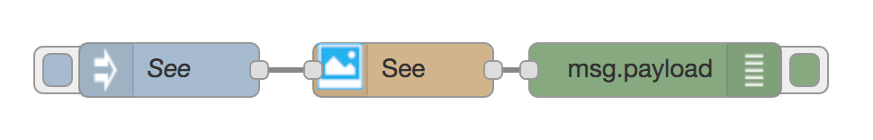

Today we’ll train TJBot to see using the Raspberry Pi camera and the Watson Visual Recognition service.

## Day 8 - Analyze Tone

Resources: [GitHub](8-analyze-tone) | [Medium](https://medium.com/@jeancarlbisson/train-tjbot-to-analyze-the-tone-in-node-red-1bd21be75917) | [YouTube](https://www.youtube.com/watch?v=VuopoVT0uCo&index=11&list=PLddOPkVMz1dtN3I_4JKava4GBLLXuUevV)

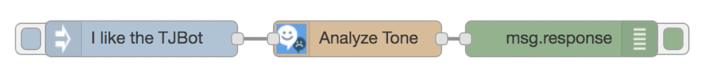

Today we’ll train TJBot to analyze three types of tones using the Watson Tone Analyzer service.

## Day 9 - Translate

Resources: [GitHub](9-translate) | [Medium](https://medium.com/@jeancarlbisson/train-tjbot-to-translate-in-node-red-dabf272ad9eb) | [YouTube](https://www.youtube.com/watch?v=oIM4dp-mctE&index=12&list=PLddOPkVMz1dtN3I_4JKava4GBLLXuUevV)

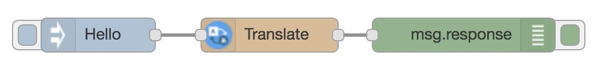

Today we’ll train TJBot to translate a greeting (for example from English to Spanish) using the Watson Language Translator service.

## Day 10 - Converse

Resources: [GitHub](10-converse) | [Medium](https://medium.com/@jeancarlbisson/train-tjbot-to-converse-in-node-red-b46bf765fd4a) | [YouTube](https://www.youtube.com/watch?v=IxQN3CLVt88&index=13&list=PLddOPkVMz1dtN3I_4JKava4GBLLXuUevV)

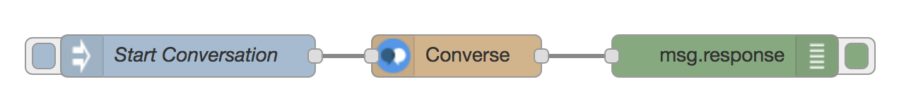

Today we’ll train TJBot to respond using the converse node and the Watson Conversation service.

## Day 11 - Analyze Emotion

Resources: [GitHub](11-analyze-emotion) | [Medium](https://medium.com/@jeancarlbisson/train-tjbot-to-analyze-emotion-in-node-red-47a8e78b2cb2) | [YouTube](https://www.youtube.com/watch?v=ggED7bpr2dg&index=14&list=PLddOPkVMz1dtN3I_4JKava4GBLLXuUevV)

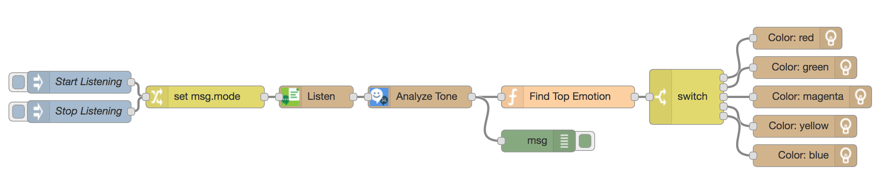

Today we’ll train TJBot to analyze the emotions of an utterance and light the LED one of five colors representing the emotions anger, disgust, fear, joy, and sadness.

## Day 12 - Identify Language

Resources: [GitHub](12-identify-language) | [Medium](https://medium.com/@jeancarlbisson/train-tjbot-to-identify-language-in-node-red-34dee98da592) | [YouTube](https://www.youtube.com/watch?v=RNiLn9WV3a0&index=15&list=PLddOPkVMz1dtN3I_4JKava4GBLLXuUevV)

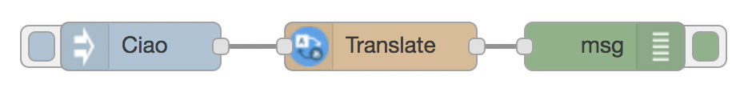

Today we’ll train TJBot to identify what language a greeting is in using the translate node and the Watson Language Translator service.

## Day 13 - Identify Language and Translate

Resources: [GitHub](13-identify-language-and-translate) | [Medium](https://medium.com/@jeancarlbisson/train-tjbot-to-identify-and-translate-greetings-in-node-red-9395b5195fe5) | [YouTube](https://www.youtube.com/watch?v=LPpXVrFXbAY&list=PLddOPkVMz1dtN3I_4JKava4GBLLXuUevV&index=16)

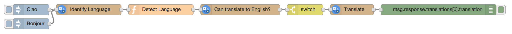

Today we’ll train TJBot to identify what language a greeting is in, check if there is a translation model to English, and translate it to English using the translate node and the Watson Language Translator service.

## Day 14 - Spell Words

Resources: [GitHub](14-spell-words) | [Medium](https://medium.com/@jeancarlbisson/train-tjbot-to-spell-words-in-node-red-9f0a9cc11a90) | [YouTube](https://www.youtube.com/watch?v=lBi5O925PNs&list=PLddOPkVMz1dtN3I_4JKava4GBLLXuUevV&index=17)

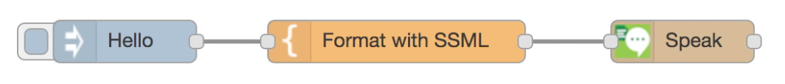

Today we’ll train TJBot to spell out the letters of words using the speak node and the Watson Text to Speech service.

## Day 15 - Identify Colors

Resources: [GitHub](15-identify-colors) | [Medium](https://medium.com/@jeancarlbisson/train-tjbot-to-identify-colors-in-node-red-f99d069e04cf) | [YouTube](https://www.youtube.com/watch?v=utIkn_Qkc_Y&list=PLddOPkVMz1dtN3I_4JKava4GBLLXuUevV&index=18)

Today we’ll train TJBot to identify colors using the see node and the Watson Visual Recognition service.

## Day 16 - Identify Objects

Resources: [GitHub](16-identify-objects) | [Medium](https://medium.com/@jeancarlbisson/train-tjbot-to-identify-objects-in-node-red-ab7420141e5f) | [YouTube](https://www.youtube.com/watch?v=AJGhEET2Qzc&index=19&list=PLddOPkVMz1dtN3I_4JKava4GBLLXuUevV)

Today we’ll train TJBot to identify objects using the see node and the Watson Visual Recognition service.

## Day 17 - Shine Light Intent

Resources: [GitHub](17-shine-light-intent) | [Medium](https://medium.com/@jeancarlbisson/train-tjbot-to-shine-with-an-intent-in-node-red-90c9991e874c) | [YouTube](https://www.youtube.com/watch?v=yG-4wXAdc0A&list=PLddOPkVMz1dtN3I_4JKava4GBLLXuUevV&index=20)

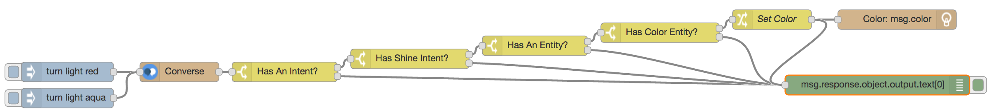

Today we’ll train TJBot how to understand natural language and shine the light a color using the converse node and the Watson Conversation service.

## Day 18 - Analyze Language Tones

Resources: [GitHub](18-analyze-language) | [Medium](https://medium.com/@jeancarlbisson/train-tjbot-to-analyze-language-tones-in-node-red-2d4db3bee59b) | [YouTube](https://www.youtube.com/watch?v=YNfDAbj_Ubk&list=PLddOPkVMz1dtN3I_4JKava4GBLLXuUevV&index=21)

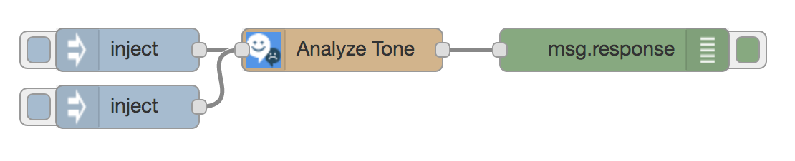

Today we’ll train TJBot how to analyze language tones using the analyze tone node and the Watson Tone Analyzer service.

## Day 19 - Wave Intent

Resources: [GitHub](19-wave-intent) | [Medium](https://medium.com/@jeancarlbisson/train-tjbot-to-wave-with-an-intent-in-node-red-dc134b9309b3) | [YouTube](https://www.youtube.com/watch?v=IVWxhUoutWk&list=PLddOPkVMz1dtN3I_4JKava4GBLLXuUevV&index=22)

Today we'll train TJBot how to understand natural language and move the arm using the converse node and the Watson Conversation service.

## Day 20 - Translator

Resources: [GitHub](20-translator) | [Medium](https://medium.com/@jeancarlbisson/train-tjbot-to-be-a-translator-in-node-red-324c4056d5cb) | [YouTube](https://www.youtube.com/watch?v=4RjcFw9imv4&list=PLddOPkVMz1dtN3I_4JKava4GBLLXuUevV&index=23)

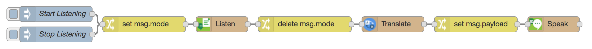

Today we'll train TJBot how to listen, translate, and speak using the listen, translate, and speak nodes and the Watson Speech to Text, Language Translator, and Text to Speech service.

## Day 21 - Suggest A Lunch Spot

Resources: [GitHub](21-suggest-a-lunch-spot) | [Medium](https://medium.com/@jeancarlbisson/train-tjbot-to-suggest-a-lunch-spot-in-node-red-ca97509b8f58) | [YouTube](https://www.youtube.com/watch?v=Eaz_o7cnlaM&list=PLddOPkVMz1dtN3I_4JKava4GBLLXuUevV&index=24)

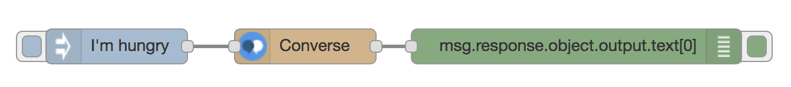

Today we'll train TJBot to suggest a lunch spot using the converse node and the Watson Conversation service.

## Day 22 - Take A Photo And Tweet It

Resources: [GitHub](22-tweet-photo) | [Medium](https://medium.com/@jeancarlbisson/train-tjbot-to-tweet-a-photo-in-node-red-e0342a617e26) | [YouTube](https://www.youtube.com/watch?v=Ejg7B4UvBjI&list=PLddOPkVMz1dtN3I_4JKava4GBLLXuUevV&index=25)

Today we'll train TJBot to take a photo with the see node and the Raspberry Pi camera and post it to Twitter.

## Day 23 - Read Direct Messages

Resources: [GitHub](23-read-direct-messages) | [Medium](https://medium.com/@jeancarlbisson/train-tjbot-to-read-direct-messages-in-node-red-e5efe2f9e49) | [YouTube](https://www.youtube.com/watch?v=5xsEWM7NRbY&list=PLddOPkVMz1dtN3I_4JKava4GBLLXuUevV&index=26)

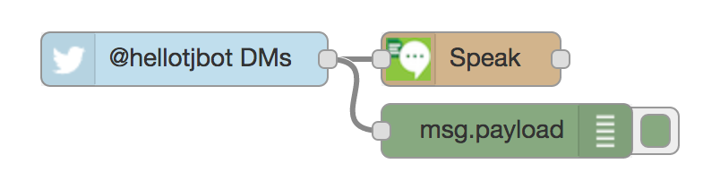 

Today we'll train TJBot to receive direct messages from Twitter and read them aloud using the speak node in Node-RED.

## Day 24 - Play Sounds

Resources: [GitHub](24-play-sounds) | [Medium](https://medium.com/@jeancarlbisson/train-tjbot-to-play-sounds-in-node-red-3c6a4197e9c0) | [YouTube](https://www.youtube.com/watch?v=guoJlkHCHGk&list=PLddOPkVMz1dtN3I_4JKava4GBLLXuUevV&index=27)

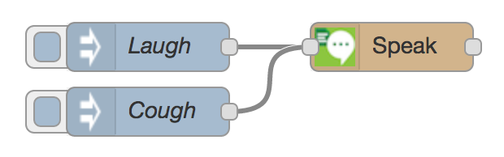 

Today we'll train TJBot to play sounds using the speak node in Node-RED.

## Day 25 - Say The Color Game

Resources: [GitHub](25-say-the-color) | [Medium](https://medium.com/@jeancarlbisson/train-tjbot-to-play-a-game-of-say-the-color-in-node-red-9cdd0375c421) | [YouTube](https://www.youtube.com/watch?v=cMJP9izsJis&list=PLddOPkVMz1dtN3I_4JKava4GBLLXuUevV&index=28)

 

Today we'll train TJBot to play a game where the player speaks the name of the color TJBot shines the light.

## Day 26 - Measure CPU Temperature

Resources: [GitHub](26-measure-cpu-temperature) | [Medium](https://medium.com/@jeancarlbisson/train-tjbot-to-measure-cpu-temperature-in-node-red-bf2cfc0ddf18) | [YouTube](https://www.youtube.com/watch?v=rXBh7zHM9b4&list=PLddOPkVMz1dtN3I_4JKava4GBLLXuUevV&index=29)

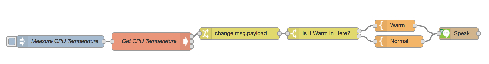 

Today we'll train TJBot to measure the CPU temperature and speak it out using the speaker and the Watson Text to Speech service.

## Day 27 - Say Weather Report

Resources: [GitHub](27-weather-report) | [Medium](https://medium.com/@jeancarlbisson/train-tjbot-to-say-the-weather-report-in-node-red-53c49f951609) | [YouTube](https://www.youtube.com/watch?v=vDflosjm75I&index=30&list=PLddOPkVMz1dtN3I_4JKava4GBLLXuUevV)

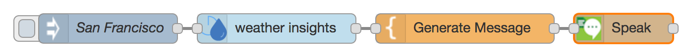 

Today we'll train TJBot to say the weather report using the Weather Insights node and the speak node.

## Day 28 - Speak Headlines

Resources: [GitHub](28-speak-headlines) | [Medium](https://medium.com/@jeancarlbisson/train-tjbot-to-speak-headlines-in-node-red-26d2de183c21) | [YouTube](https://www.youtube.com/watch?v=12_wa1pR_K8&index=31&list=PLddOPkVMz1dtN3I_4JKava4GBLLXuUevV)

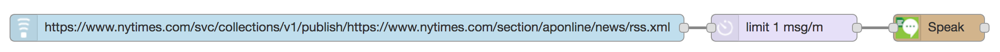 

Today we'll train TJBot to speak the headlines from an RSS feed using the Watson Text to Speech service and the speak node.

## Day 29 - Send A Text Message

Resources: [GitHub](29-send-text-message) | [Medium](https://medium.com/@jeancarlbisson/train-tjbot-to-send-a-text-message-in-node-red-365157d71bb1) | [YouTube](https://www.youtube.com/watch?v=WQ7LiHp9wKk&index=32&list=PLddOPkVMz1dtN3I_4JKava)

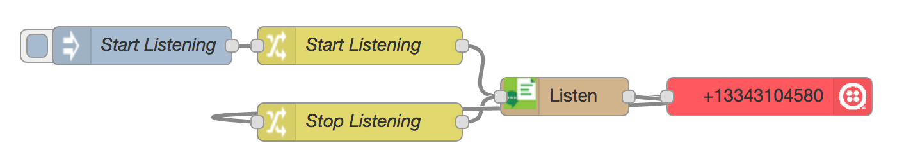 

Today we'll train TJBot to listen to the microphone and then send a text message via the Twilio service.

## Day 30 - Analyze Social Tones

coming tomorrow...

## License

This code is licensed under Apache 2.0. Full license text is available in [LICENSE](LICENSE).
4GBLLXuUevV